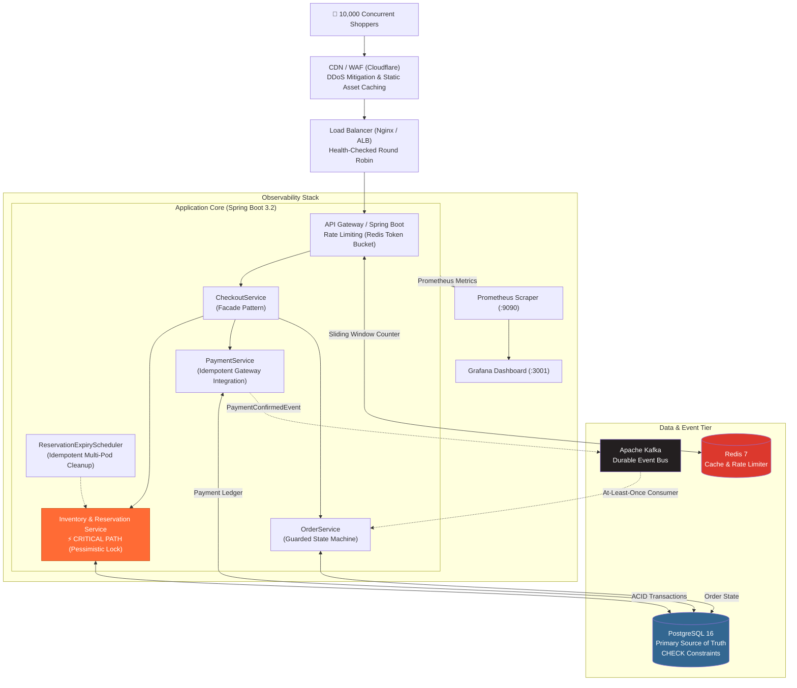
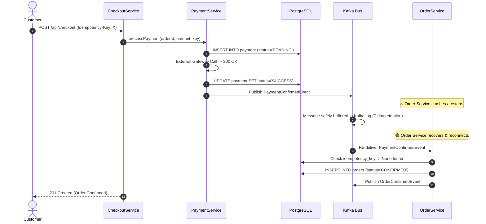

<div align="center">

# ⚡ SALESTORM
### High-Concurrency Flash Sale Architecture & Resilient Prototype
**TeamPanda | SYSCRAFTERS Hackathon 2026**

[](https://www.oracle.com/java/)
[](https://spring.io/projects/spring-boot)
[](https://react.dev/)
[](https://www.typescriptlang.org/)
[](https://www.postgresql.org/)
[](https://redis.io/)
[](https://kafka.apache.org/)
[](https://www.docker.com/)

<p align="center">
  <b>Zero Overselling &bull; Deterministic Pessimistic Locking &bull; Idempotent Pipelines &bull; Event-Driven Crash Recovery</b>
</p>

[System Architecture](#-system-architecture) &bull;
[Key Invariants](#-hard-invariants) &bull;
[Concurrency Strategy](#-concurrency--locking-deep-dive) &bull;
[Crash Recovery](#-order--payment-crash-recovery) &bull;
[Simulation Proof](#-empirical-proof--simulation-results) &bull;
[Quick Start](#-quick-start) &bull;
[Documentation Index](#-architecture-decisions--documentation)

---

</div>

## 📌 Executive Summary & The Problem

During a flash sale, sudden traffic spikes expose fundamental concurrency and consistency weaknesses in distributed e-commerce architectures:
* **10,000 users** simultaneously click **"Buy Now"** within a 1-second burst window.
* Only **100 units** of the flash-sale product exist in stock.
* Without serialized concurrency control, concurrent reads cause race conditions, resulting in **overselling**, **inventory numbers dropping below zero**, and **inconsistent customer account balances**.
* In microservices, downstream failures (e.g., payment gateway timeouts, order service pod crashes) cause **money deduction without order creation** or **abandoned reserved stock that never gets restocked**.

**SALESTORM** is a production-grade architectural blueprint and working prototype engineered to solve these challenges with mathematical correctness, fault-tolerance, and full auditability.

---

## 🛡️ Hard Invariants

The entire system is architected around non-negotiable guarantees enforced at both the database and application levels:

| Guarantee | Mathematical Invariant | Enforcement Mechanism |
|---|---|---|
| **Zero Overselling** | $\text{sold\_quantity} \le 100$ | Pessimistic DB Write Locks (`SELECT ... FOR UPDATE`) |
| **No Negative Inventory** | $\text{available\_quantity} \ge 0$ | PostgreSQL `CHECK` Constraint + Service Validation |
| **Conserved Stock** | $\text{avail} + \text{resv} + \text{sold} = \text{total}$ | DB-level atomic transaction boundary |
| **No Duplicate Purchases** | Exactly 1 reservation per request | Unique index on client `Idempotency-Key` |
| **No Double Charges** | 1 gateway charge attempt per key | Unique `idempotency_key` on payment ledger table |
| **Zero Lost Orders** | Payment Success $\implies$ Order Created | Kafka event-driven log with consumer retry & DLQ |

---

## 🏗️ System Architecture

SALESTORM utilizes a layered, resilient architecture designed to decouple synchronous user interactions from asynchronous background fulfillment:



### Communication Flow: Sync vs. Async

| Interaction | Mode | Protocol | Rationale |
|---|---|---|---|
| **Inventory Reservation** | **Synchronous** | REST POST + Row Lock | Customer immediately knows if they secured a unit. |
| **Payment Authorization** | **Synchronous** | REST POST $\to$ Gateway | Customer must receive immediate payment outcome. |
| **Order Processing** | **Asynchronous** | Kafka (`payment.confirmed`) | Order Service can restart or recover without dropping paid orders. |
| **Inventory Release** | **Asynchronous** | Background Cron (every 30s) | Reclaims stock from abandoned checkouts automatically. |
| **Customer Notification** | **Asynchronous** | Kafka (`order.confirmed`) | Notification provider outages never fail or delay an order. |

---

## ⚡ Concurrency & Locking Deep Dive

### Why Pessimistic Locking over Optimistic Locking?

Under standard e-commerce traffic, **Optimistic Locking** (using `@Version` or CAS) works well. However, in an extreme flash-sale scenario (10,000 threads competing for 100 units on a single row):

```
Optimistic Locking Under Flash Sale:
Thread 1..10000 read version = 0
Thread 1 commits (version -> 1)
Remaining 9,999 threads fail with OptimisticLockException
Massive retry storm hammers CPU, exhausts connection pools, and inflates P99 latency past 15s.
```

**SALESTORM's Choice: Pessimistic Write Locking (`SELECT ... FOR UPDATE`)**:
* Every reservation request locks the target product inventory row inside an isolated transaction.
* Threads queue sequentially at the database engine.
* The first 100 threads successfully decrement `available_quantity` and increment `reserved_quantity`.
* Thread 101 instantly reads `available_quantity == 0` and returns `409 Conflict (Sold Out)` without retrying.
* **Result**: Predictable P99 latency (<2000ms), zero retry storms, and zero chance of race conditions.

```sql
-- Executed inside @Transactional InventoryService.reserveInventory
SELECT product_id, available_quantity, reserved_quantity, sold_quantity 
FROM inventory 
WHERE product_id = ? 
FOR UPDATE;
```

---

## 🔄 Order & Payment Crash Recovery

One of the most dangerous edge-cases in distributed commerce:
> **Payment succeeds at the external gateway, but the Order Service crashes or network drops before the order record is written.**



1. **At-Least-Once Delivery**: Kafka guarantees the `PaymentConfirmedEvent` persists even during total service downtime.
2. **Idempotent Consumers**: The recovering `OrderService` checks `orderRepository.findByIdempotencyKey(key)`. If previously written, it commits the Kafka offset and ignores duplicates.
3. **Dead Letter Queue (DLQ)**: Poison pill messages are retried with exponential backoff before routing to `payment.confirmed.dlq` for operator inspection.

---

## 📊 Empirical Proof & Simulation Results

To validate the architecture before deploying under real traffic, SALESTORM includes a multithreaded stress simulator ([`simulation/simulate.py`](simulation/simulate.py)) that launches **10,000 concurrent threads** with simulated duplicates and network dropouts against a 100-unit inventory.

```
========================================
SALESTORM FLASH SALE SIMULATION
========================================
Initial Inventory       : 100
Concurrent Purchase VUs : 10,000

Successful Reservations : 111  (100 final sold + 11 released after failure)
Rejected - Sold Out     : 9,689
Duplicate Double-Clicks : 200
Simulated Pay Failures  : 7
Simulated Timeouts      : 4

Final Available Stock   : 0
Final Reserved Stock    : 0
Final Sold Stock        : 100

Overselling Occurrences : 0  <-- ZERO OVERSELLING
Negative Inventory Hits : 0  <-- NO NEGATIVE STOCK
Invariant Conserved     : True (avail + resv + sold == 100)
========================================
```

---

## 🧩 Software Design: SOLID & Design Patterns

The codebase adheres strictly to clean code principles:

* **Single Responsibility Principle (SRP)**:
  * `InventoryService`: Manages stock row locks and reservation states only.
  * `PaymentService`: Interacts with gateway ledgers and records idempotency.
  * `ReservationExpiryScheduler`: Idempotent multi-pod background cleanup only.
* **Open/Closed Principle (OCP)**:
  * Payment gateways plug into a unified provider contract; new gateways (Stripe, Razorpay) plug in without modifying order or inventory business logic.
* **Liskov Substitution Principle (LSP)**:
  * Repositories implement standard Spring Data abstractions, swappable for in-memory doubles during testing.
* **Interface Segregation Principle (ISP)**:
  * Repositories expose segregated, minimal queries (`findByIdForUpdate`, `releaseIfStillReserved`).
* **Dependency Inversion Principle (DIP)**:
  * High-level orchestrators (`CheckoutService`) depend on service abstractions, assembled via constructor injection.

### Design Patterns Applied:
1. **Facade Pattern** ([`CheckoutService.java`](backend/src/main/java/com/salestorm/service/CheckoutService.java)): Shields controllers from multi-step coordination across Inventory, Payment, and Orders.
2. **State Pattern** ([`Order.java`](backend/src/main/java/com/salestorm/domain/Order.java)): Enforces strict legal lifecycle transitions (`CREATED` $\to$ `PAYMENT_PENDING` $\to$ `CONFIRMED` $\to$ `PROCESSING` $\to$ `SHIPPED` $\to$ `DELIVERED`).
3. **Repository Pattern**: Segregates business rules from persistence mechanisms.
4. **Idempotent Consumer Pattern**: Guarantees exactly-once processing over at-least-once message brokers.

---

## 🛠️ Tech Stack & Directory Structure

```
TeamPanda/
├── backend/                       # Java 21 / Spring Boot 3.2 Monolith-Prototype
│   ├── src/main/java/com/salestorm/
│   │   ├── domain/                # Entities: Inventory, Reservation, Payment, Order
│   │   ├── repository/            # Custom Spring Data JPA with PESSIMISTIC_WRITE
│   │   ├── service/               # Core business services & Facade
│   │   ├── controller/            # REST API endpoints (/api/reservations, /api/checkout)
│   │   ├── scheduler/             # Background expired reservation cleanup
│   │   └── simulator/             # Chaos & Failure injector for demo
│   └── src/test/                  # Comprehensive JUnit 5 & Mockito test suite
├── frontend/                      # React 18 + TypeScript + Vite
│   ├── src/                       # Live telemetry dashboard & checkout UI
│   ├── Dockerfile                 # Multi-stage build + Nginx alpine
│   └── nginx.conf                 # SPA routing & API reverse proxy
├── infrastructure/
│   ├── postgres/init.sql          # DB DDL, indexes, and CHECK constraints
│   └── monitoring/prometheus.yml  # Actuator scraping configuration
├── simulation/
│   ├── simulate.py                # 10,000-thread Python concurrency simulator
│   └── results.md                 # Detailed mathematical verification output
├── tests/
│   └── load-test.js               # k6 flash sale spike script (10k VUs, 30s)
├── docs/
│   ├── ADR/                       # 7 Architecture Decision Records
│   ├── diagrams/                  # 11 Mermaid UML diagrams
│   └── ...                        # Deep-dive design documentation
├── docker-compose.yml             # Full-stack orchestrator
└── .env.example                   # Environment configuration template
```

---

## 🚀 Quick Start

### Prerequisites
* [Docker & Docker Compose](https://www.docker.com/products/docker-desktop/) installed and running.
* (Optional for manual execution) Java 17/21 JDK, Node.js 20+, Python 3.10+, and k6.

### Option A: Complete Docker Compose Stack (Recommended)

Start the entire system (Postgres, Redis, Kafka, Backend, Frontend, Prometheus, Grafana) with a single command:

```bash
docker compose up --build
```

Access the services:
* **Frontend Web Dashboard**: [http://localhost:3000](http://localhost:3000)
* **Backend REST API**: [http://localhost:8080](http://localhost:8080)
* **Prometheus Metrics**: [http://localhost:9090](http://localhost:9090)
* **Grafana Dashboards**: [http://localhost:3001](http://localhost:3001) *(login: `admin` / `salestorm`)*

---

### Option B: Local Development

#### 1. Backend
```bash
cd backend
./mvnw spring-boot:run
```
*The backend runs on port 8080. By default, it uses an in-memory H2 database with PostgreSQL compatibility mode.*

#### 2. Frontend
```bash
cd frontend
npm install
npm run dev
```
*Access the Vite dev server at [http://localhost:5173](http://localhost:5173).*

---

### Option C: Running Verifications & Tests

#### Unit Tests (JUnit 5 + Mockito)
```bash
cd backend
./mvnw test
```

#### 10,000-Thread Concurrency Simulation
```bash
python simulation/simulate.py
```

#### k6 Load Test (Spike Test)
```bash
k6 run tests/load-test.js
```

---

## 📡 REST API Reference

All mutating endpoints require an `Idempotency-Key` header to protect against network retries and double-clicks.

### 1. Reserve Inventory
```http
POST /api/reservations
Content-Type: application/json
Idempotency-Key: RES-UUID-12345

{
  "productId": 101,
  "customerId": 42,
  "quantity": 1
}
```
* **`201 Created`**: Reservation successful. Returns `{ reservationId, status: "RESERVED", expiresAt }`.
* **`409 Conflict`**: Product sold out (`{ error: "INVENTORY_SOLD_OUT" }`).
* **`200 OK`**: Duplicate idempotency key detected; returns original reservation.

### 2. Complete Checkout (Facade)
```http
POST /api/checkout
Content-Type: application/json
Idempotency-Key: CHK-UUID-67890

{
  "productId": 101,
  "customerId": 42,
  "quantity": 1,
  "unitPrice": 999.99
}
```
* **`201 Created`**: Complete purchase flow succeeded (`RESERVED` $\to$ `PAID` $\to$ `CONFIRMED`).
* **`402 Payment Required`**: Simulated or external payment failure; reservation automatically released.
* **`409 Conflict`**: Sold out.

### 3. Release Reservation
```http
POST /api/reservations/{reservationId}/release
```
* **`200 OK`**: Reservation released and quantity restored to available pool.
* **`409 Conflict`**: Reservation already expired, sold, or released.

---

## 📚 Architecture Decisions & Documentation

All architectural decisions are documented in detail in [`docs/`](docs/):

| Document | Description |
|---|---|
| [**ADR-001: SQL vs NoSQL**](docs/ADR/ADR-001-sql-vs-nosql.md) | PostgreSQL ACID guarantees vs NoSQL eventual consistency |
| [**ADR-002: Sync vs Async**](docs/ADR/ADR-002-sync-vs-async.md) | Synchronous reservations vs asynchronous order fulfillment |
| [**ADR-003: Concurrency Control**](docs/ADR/ADR-003-concurrency-strategy.md) | In-depth trade-off analysis of Pessimistic vs Optimistic locking |
| [**ADR-004: Event Broker (Kafka)**](docs/ADR/ADR-004-kafka.md) | Durable message queues for reliable crash recovery |
| [**ADR-005: Redis Caching Strategy**](docs/ADR/ADR-005-redis.md) | Cache-aside stock counter & sliding window rate limits |
| [**ADR-006: Idempotency Design**](docs/ADR/ADR-006-idempotency.md) | Dual-tier idempotency protection mechanism |
| [**ADR-007: Order Recovery**](docs/ADR/ADR-007-order-recovery.md) | Recovery pattern when Order Service fails post-payment |
| [**Failure Scenarios**](docs/failure-scenarios.md) | Comprehensive failure matrix covering 13 distinct failure modes |
| [**SOLID & Patterns**](docs/solid.md) | Code symbol mapping for clean architecture principles |
| [**5-Minute Pitch Script**](docs/final-pitch.md) | Timed pitch script prepared for the jury demonstration |
| [**Jury Q&A Cheat Sheet**](docs/jury-questions.md) | Prepared technical defenses for common system design questions |

---

## 👥 Authors & Team Panda
* **Team Panda** — Built for the System Design Hackathon.
* Designed with an **Architecture-First, Correctness-Driven** engineering philosophy.
